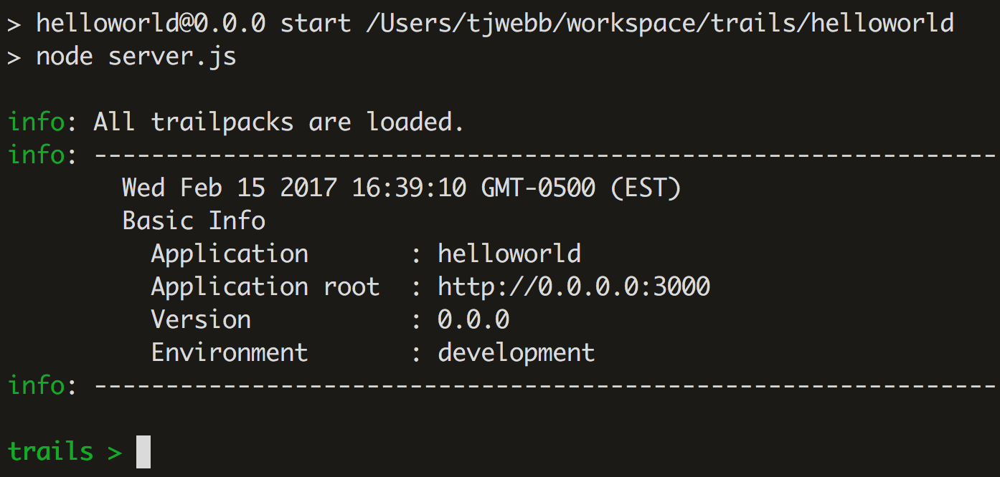

*Previous: [Build](index.md)*

# 2.1 Controller

This guide walks through creating a new Controller, implementing handlers, and configuring routes. We'll cover how to build endpoints for both [REST](https://en.wikipedia.org/wiki/Representational_state_transfer) and [GraphQL](http://www.graphql.com/).

# REST

First, we'll walk through setting up a typical REST-compatible web service that accepts client requests, and returns JSON.

## Create a Controller

Trails includes generators for common templates, such as Controllers. To create a Controller named `FirstController`, open up your console and type the following command:

#### `yo trails:controller FirstController`

Enter a `description` when prompted. The console ouput will look like this:

```
? Controller Description handles hello world requests
   create api/controllers/FirstController.js
   create test/integration/controllers/FirstController.test.js
   create api/controllers/index.js

```

The generator will create/update the following files:

#### `api/controllers/index.js`

Each directory in a Trails application contains a manifest of the modules contained therein. Trails does not assume any particular directory structure, so you may separate these files into other folders--or other modules--if you wish, by updating the manifest. This is discussed further in [Extend: Re-usable Services](../extend/services.md). The generators will update these automatically, and you usually shouldn't need to be concerned with them.

```js
exports.FirstController = require('./FirstController')
```

#### `api/controllers/FirstController.js`

A stub for the `FirstController` class.

```js
// api/controllers/FirstController.js

/**
 * @module FirstController
 * @description handles hello world requests.
 */
module.exports = class FirstController extends Controller {

}
```

### `test/integration/controllers/FirstController.test.js`

A stub for testing our Controller.

```js
const assert = require('assert')

describe('FirstController', () => {
  it('should exist', () => {
    assert(global.app.controllers.FirstController)
  })
})
```

*Note: Trails supports multiple web servers, such as Hapi and Express. As a result, the implementation of Controller handlers will differ slightly among Trails applications that use different web servers. In these examples and in the [Start](../start.md) guide, we are using Hapi.*

## Create a Simple REST Handler

Handlers are aptly-named: they *handle* web requests. Their job is to parse incoming requests, and to respond to the client with the information it has requested. In our `FirstController`, let's create a handler called `sayHello` that simply returns the following JSON:

```js
// api/controllers/FirstController.js

/**
 * @module FirstController
 * @description handles hello world requests.
 */
module.exports = class FirstController extends Controller {

  /**
   * Tell the client "hello"
   */
  sayHello (request, reply) {
    reply({
      message: "hello world!"
    })
  }
}
```

## Configure a Route

In order for the request to reach the handler, we configure a **Route** to map the handler method to a URL.

```js
// config/routes.js
module.exports = [
  {
    method: [ 'GET' ],
    path: '/first/sayHello',
    handler: 'FirstController.sayHello'
  }
]
```

#### `method`

This is a list of HTTP methods the server will accept. A good rule of thumb for how to choose which methods to accept, based on the functionality of the handler:

- `POST`: Create
- `GET`: Read
- `PUT`: Update
- `DELETE`: Delete

#### `path`

The client will invoke the `handler` by making a request that matches the URL in the `path` property. A common convention is to structure the path based on the names of the Controller and the handler method. Thus, `/first/sayHello -> FirstController.sayHello`.

#### `handler`

The Controller method to route the request to. In the Route configuration above, a `GET` request to `/first/sayHello` will invoke the handler `FirstController.sayHello`.

- Request: `GET /first/sayHello`
- Response:
  ```js
  {
    "message": "hello world!"
  }
  ```

### Try it out!

Now that you've finished implementing and configuring your first Controller, let's try it out! New Trails applications includes a [REPL](https://github.com/trailsjs/trailpack-repl) that let you interact with the application while it's running. After you run `npm start`, you should see something like this:



Now, you can test out your new Controller right in the Trails console:

```
trails > get('/first/sayHello')
trails > info: 200
{ message: 'hello world!' }
```

Congratulations! The response code [`200`](https://en.wikipedia.org/wiki/List_of_HTTP_status_codes#2xx_Success) indicates that the request was successful, and below it is our expected response!

## Create a Dynamic REST Handler (Query Parameters)

Typically, the server will send more interesting responses to the client, and base those responses on arguments that the client sends along with the request. Based on the client's `name`, we can easily customize the content of the response:

```js
  /**
   * Tell the client "hello"
   */
  sayHello (request, reply) {
    const { name } = request.query

    reply({
      message: `hello ${name}!`
    })
  }
```

- Request: `GET /first/sayHello?name=trailsjs`
- Response:
```js
{
  "message": "hello trailsjs!"
}
```

### Create a Dynamic REST Handler (Path Parameters)

We can utilize the Route `path` itself to help us parameterize client requests. For example, instead of telling everyone **"hello"**, let's enable the client to specify a custom `prefix` to the message`. We'll make a couple simple changes to the Controller and the Route config.

First, we'll extract the `prefix` parameter from the path itself:

```js
  /**
   * Tell the client something special!
   */
  sayHello (request, reply) {
    const { name } = request.query
    const { prefix } = request.params

    reply({
      message: `${prefix} ${name}!`
    })
  }
```

And update the route config to match a `prefix` path parameter:

```js
// config/routes.js
module.exports = [
  {
    method: [ 'GET' ],
    path: '/first/sayHello/{prefix}',
    handler: 'FirstController.sayHello'
  }
]
```

Now our request/response looks like this:

- Request: `GET /first/sayHello/howdy?name=trailsjs`
- Response:
```js
{
  "message": "howdy trailsjs!"
}
```

Pretty cool!

# GraphQL

Coming soon.

### Next: [Service](service.md)
